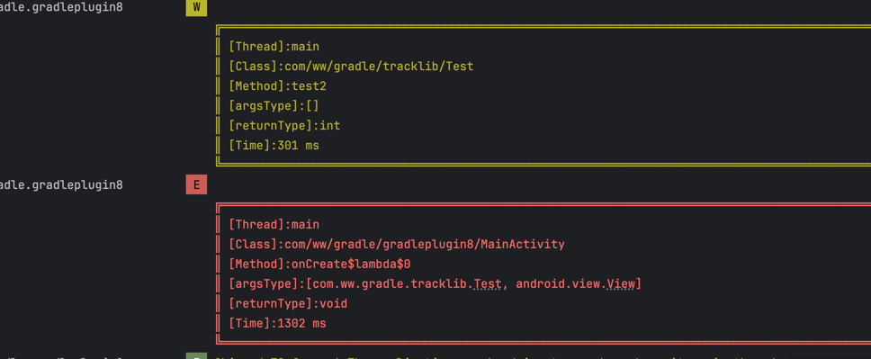

基于gradle8.0+   和kts 编写 发布 gralde插件 熟悉一下kts   熟悉一下在transformAPI废除以后实现字节码插桩
## 这是一个基于ASM实现的函数耗时检测库

## 效果



### 日志等级

1. 通过日志等级即可查看函数耗时范围，插件默认提供了4种级别，可以根据级别快速过滤
   - <=100ms Log.d
   - <=300ms Log.i
   - <=500ms Log.w
   - 否则 Log.e

### 展示信息

- Thread：方法所执行的线程
- Class：方法所在的类
- Method：方法名
- ArgsType：参数类型
- ReturnType：返回类型
- Time：函数耗时

> 如果需要快速过滤方法所执行的线程则可以自定义日志过滤器为线程名称即可实现

## 快速使用

1. 在项目的build.gradle集成指定插件

   ```kotlin
   dependencies {
       classpath 'com.github.weiwei0928.GradlePlugin8:gradle-plugin-lib:1.0.3' //依赖插件仓库
   }
   ```

> **allprojects和buildscript节点下加入仓库地址**
>
> ```kotlin
> repositories {
>  		maven(url = "https://jitpack.io")
>  }
>  ```

2. 在app的build.gradle(.kts) 中

   ```.kotlin
   plugins {
       id("com.ww.plugin.track")
   }
   ```

3. 在dependencies添加指定依赖

   ```groovy
   implementation 'com.github.weiwei0928.GradlePlugin8:hookLib:1.0.3'
   ```

4. 设置hook插件的配置参数

   ```kotlin
   hook {
       ableHook = true//是否启用代码插桩
       scopeAll = true //是否将所有的方法都插桩，否则只插桩当前项目工程
   }
   
   ```

5. 在日志通过MethodHookHandler过滤TAG即可看到效果

------


